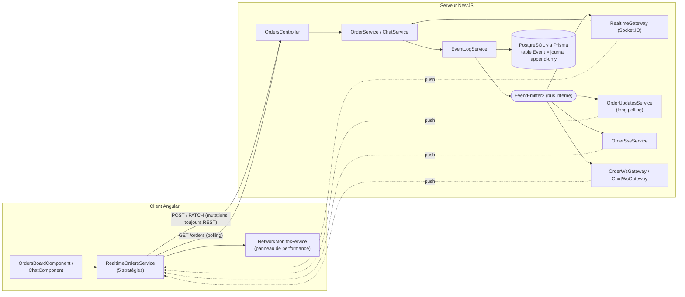
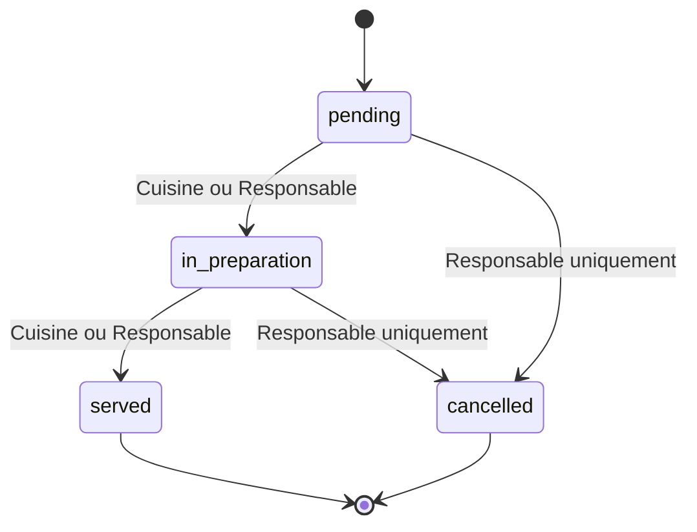
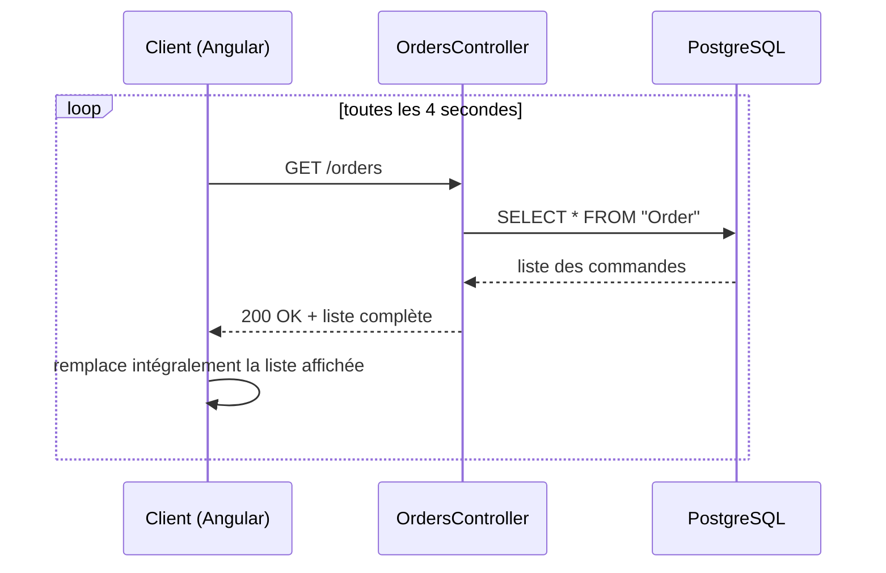
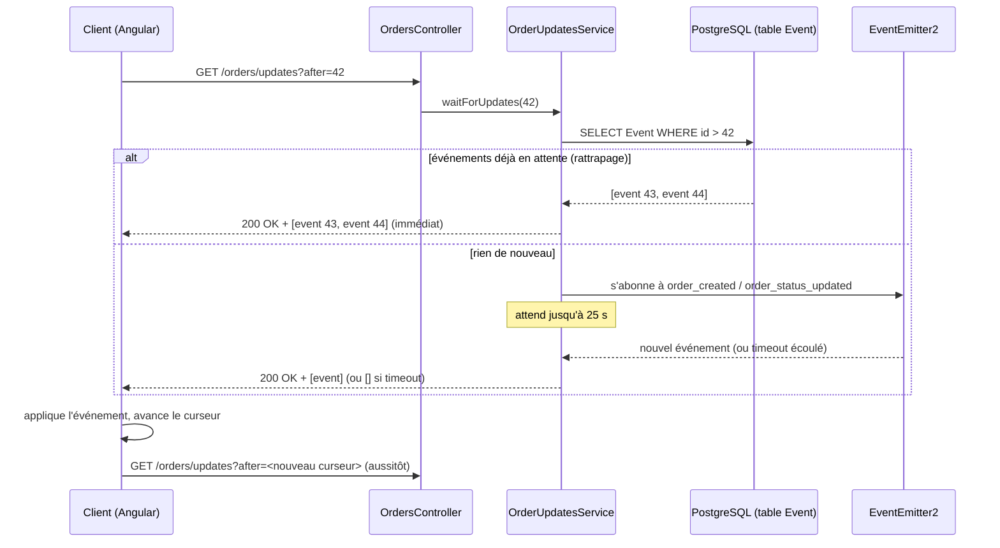
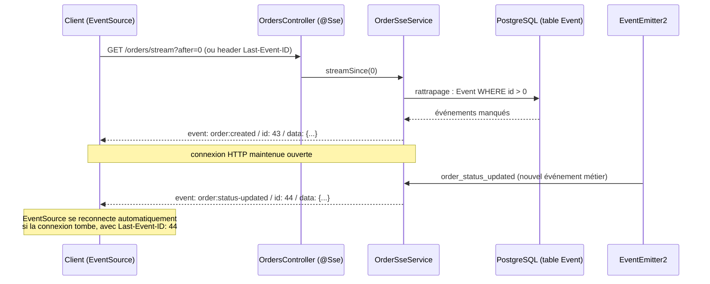
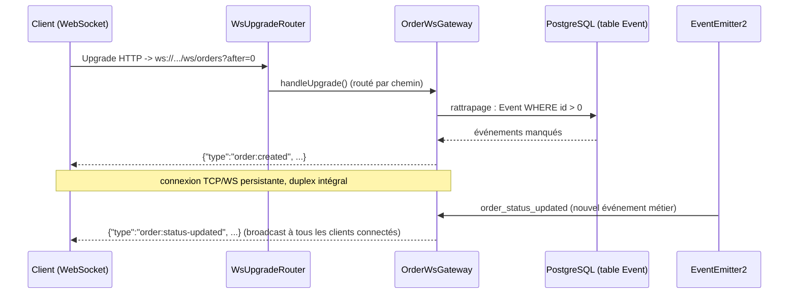
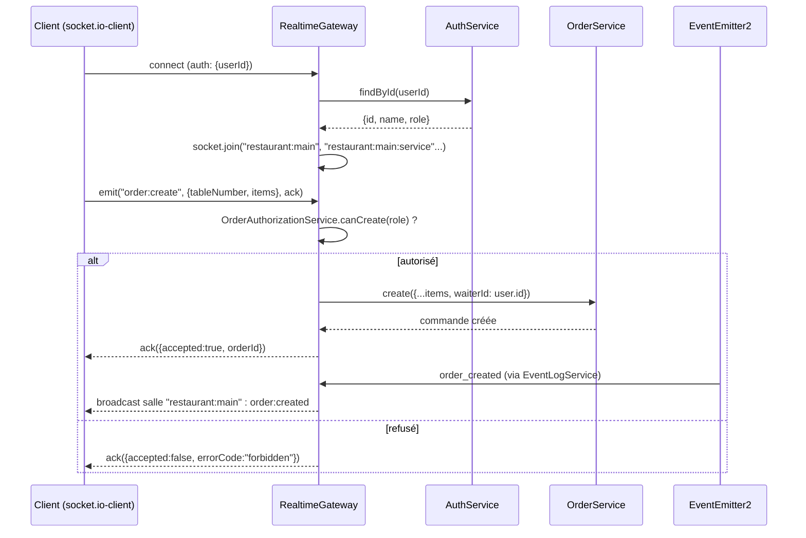
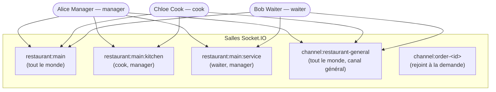

# RestoCommande Dossier technique

**Présenté par : Moise AGANZE LWABOSHI** 

---

**Objectif du projet :** Illustre les 5 mécanismes de communication temps réel (Polling, Long polling, SSE, WebSocket natif, Socket.IO), implémentés côte à côte et sélectionnables en direct depuis l'interface.

---

## Sommaire

1. [Besoin client et reformulation](#1-besoin-client-et-reformulation)
2. [Acteurs et parcours utilisateurs](#2-acteurs-et-parcours-utilisateurs)
3. [Exigences fonctionnelles et non fonctionnelles](#3-exigences-fonctionnelles-et-non-fonctionnelles)
4. [Architecture retenue et sa justification](#4-architecture-retenue-et-sa-justification)
5. [Cycle de vie d'une commande](#5-cycle-de-vie-dune-commande)
6. [Les 5 mécanismes temps réel — détail, classes, diagrammes, performance](#6-les-5-mécanismes-temps-réel)
   - [6.1 Polling](#61-polling)
   - [6.2 Long polling](#62-long-polling)
   - [6.3 Server-Sent Events (SSE)](#63-server-sent-events-sse)
   - [6.4 WebSocket natif](#64-websocket-natif)
   - [6.5 Socket.IO](#65-socketio)
7. [Tableau comparatif de synthèse](#7-tableau-comparatif-de-synthèse)
8. [Salles, rôles et autorisations](#8-salles-rôles-et-autorisations)
9. [Catalogue des événements et des commandes](#9-catalogue-des-événements-et-des-commandes)
10. [Sécurité et fiabilité](#10-sécurité-et-fiabilité)
11. [Preuves de tests multi-clients, déconnexion et isolation](#11-preuves-de-tests-multi-clients-déconnexion-et-isolation)
12. [Limites de la solution et améliorations possibles](#12-limites-de-la-solution-et-améliorations-possibles)
13. [Sources officielles](#13-sources-officielles)

---

## 1. Besoin client et reformulation

Un restaurant a besoin d'un tableau de commandes partagé entre trois postes qui ne travaillent jamais au même endroit ni sur le même rythme :

- **le serveur**, en salle, qui prend les commandes ;
- **la cuisine**, qui doit voir apparaître une commande validée sans avoir à rafraîchir quoi que ce soit ;
- **le responsable**, qui supervise l'ensemble du service et peut intervenir (annulation).

Ces trois postes doivent voir les mêmes commandes évoluer **en temps réel**, sans recharger la page, et pouvoir échanger des messages courts (allergie signalée, retard en cuisine, etc.) via un chat d'équipe. Le besoin n'est pas seulement fonctionnel : c'est aussi un besoin **pédagogique** — comparer concrètement, sur la même application, plusieurs façons d'obtenir ce temps réel, avec leurs coûts et leurs limites respectifs.

## 2. Acteurs et parcours utilisateurs

| Acteur | Rôle technique | Peut faire |
|---|---|---|
| Serveur | `waiter` | Créer une commande pour une table, voir ses commandes, envoyer des messages |
| Cuisine | `cook` | Voir les commandes à préparer, faire avancer leur statut (`pending → in_preparation → served`) |
| Responsable | `manager` | Voir toutes les commandes, **annuler** une commande, accéder à tous les canaux de chat |

Parcours type : le serveur se connecte ([login.component.ts](../frontend/src/app/features/login/login.component.ts)), saisit une commande pour la table 7 ([orders-board.component.ts](../frontend/src/app/features/orders/orders-board.component.ts)) → la cuisine la voit apparaître dans la colonne « À préparer » sans action de sa part → le serveur voit le statut passer à « En préparation » puis « Servie » → en cas de souci, le responsable annule ; tout le monde peut échanger sur le canal général ou un canal lié à une commande ([chat.component.ts](../frontend/src/app/features/chat/chat.component.ts)).

## 3. Exigences fonctionnelles et non fonctionnelles

**Fonctionnelles**
- Créer, lister, faire évoluer et annuler une commande, avec contrôle des transitions et des rôles.
- Recevoir les nouvelles commandes et changements de statut sans rechargement.
- Chat général + fil par commande, avec historique.
- Choisir explicitement, en direct, le mécanisme de réception des mises à jour (Polling / Long polling / SSE / WebSocket / Socket.IO).
- Observer en direct les requêtes/événements de chaque mécanisme (panneau de performance).

**Non fonctionnelles**
- Le serveur reste l'**autorité** sur les données : aucun client ne modifie l'état partagé directement, il demande une transition que le serveur valide ([order.service.ts](../backend/src/order/order.service.ts)).
- L'identité d'un utilisateur ne provient jamais du contenu d'un message client, toujours d'une résolution côté serveur.
- Traitement idempotent des événements côté client (rejouer un événement déjà connu n'a pas d'effet).
- Reprise automatique après coupure réseau pour les mécanismes qui le permettent nativement (SSE, WebSocket, Socket.IO).

## 4. Architecture retenue et sa justification

Principe directeur : **séparer le cœur métier du transport**. Un seul service écrit les données et publie les événements ; tous les mécanismes temps réel ne font qu'écouter ou rejouer ce flux — jamais l'inverse. Ça évite de dupliquer la logique métier cinq fois (une par mécanisme) et ça garantit que peu importe le mode choisi côté client, le comportement métier (transitions, autorisations) est rigoureusement identique.



**Pourquoi ce découpage ?**
- `EventLogService` ([event-log.service.ts](../backend/src/events/event-log.service.ts)) est le **seul** point d'écriture d'un événement : il persiste une ligne dans la table `Event` (id auto-incrémenté = curseur stable pour le rattrapage) *et* publie sur `EventEmitter2` (push immédiat). Chaque transport (`OrderSseService`, `OrderWsGateway`, `RealtimeGateway`, `OrderUpdatesService`) n'a qu'à s'abonner à ce bus — il n'écrit jamais de logique métier lui-même.
- Les **mutations** (créer une commande, changer son statut) passent toujours par REST, quel que soit le mode de réception choisi côté client. Seule la façon de RECEVOIR les mises à jour change. Ça simplifie radicalement le frontend : un seul `OrdersApiService` pour écrire, cinq stratégies interchangeables pour lire.
- PostgreSQL + Prisma pour la persistance (contrainte du projet), avec la table `Event` comme journal d'événements séparé des tables métier (`Order`, `ChatMessage`) — la commande reste un objet métier propre, l'historique d'événements est une préoccupation à part qui sert uniquement au temps réel (rattrapage, replay).
- Zod ([shared/](../shared/src)) comme contrat unique partagé entre backend et frontend : mêmes schémas validés des deux côtés, un seul endroit où faire évoluer la forme d'un événement.

## 5. Cycle de vie d'une commande

Modèle simplifié à 4 états (par rapport au diagramme à 6 états du cahier des charges, « Validée » et « Prête » ont été fusionnées respectivement dans `pending`/`in_preparation` et `served`, pour rester gérable sur un projet à une seule séance de développement dédiée aux commandes) :



Table exacte des transitions, telle qu'appliquée par [order.service.ts](../backend/src/order/order.service.ts) :

```ts
const ALLOWED_TRANSITIONS: Record<OrderStatus, OrderStatus[]> = {
  pending: ['in_preparation', 'cancelled'],
  in_preparation: ['served', 'cancelled'],
  served: [],
  cancelled: [],
};
```

Chaque changement de statut est demandé avec un couple `(expectedStatus, requestedStatus)` : si le statut réel en base ne correspond plus à `expectedStatus` (un autre client a modifié la commande entre-temps), le serveur répond `409 Conflict` plutôt que d'écraser silencieusement le changement concurrent — c'est le mécanisme de concurrence optimiste demandé par le cahier des charges.

## 6. Les 5 mécanismes temps réel

### 6.1 Polling

**Principe.** Le client interroge le serveur à intervalle fixe (`GET /orders`), sans savoir si quelque chose a changé. Le serveur répond toujours avec l'état complet actuel. C'est le mécanisme le plus simple : aucune connexion longue durée, aucune gestion d'état côté serveur entre deux appels.

**Classes qui l'implémentent**

| Fichier | Rôle |
|---|---|
| [orders.controller.ts](../backend/src/order/orders.controller.ts) — `GET /orders` | Renvoie la liste complète des commandes |
| [order.service.ts](../backend/src/order/order.service.ts) — `list()` | Requête Prisma `findMany` |
| [realtime-orders.service.ts](../frontend/src/app/core/services/realtime-orders.service.ts) — `startPolling()` | `setInterval` (4s), remplace intégralement le signal `orders` |

**Diagramme de séquence**



**Avantages**
- Le plus simple à implémenter et à déboguer (une seule requête HTTP classique).
- Aucun état de connexion à maintenir côté serveur — passe à l'échelle sans effort particulier, compatible avec n'importe quel proxy/CDN/cache.
- Résiste naturellement aux coupures réseau : chaque tick repart de zéro.

**Inconvénients**
- Latence structurelle = jusqu'à l'intervalle complet (ici jusqu'à 4s) même si rien n'a changé pendant 3,99 s.
- Beaucoup de requêtes inutiles quand rien ne change (charge serveur proportionnelle au nombre de clients × fréquence, pas à l'activité réelle).
- Impossible de descendre l'intervalle sans faire exploser la charge serveur — mauvais compromis latence/coût.

**Performance observée** (mesures locales, `localhost`, panneau de performance de l'application) :

| Requête | Latence mesurée |
|---|---|
| `GET /orders` | 11 – 19 ms |

Sur un réseau réel (client mobile, 4G, restaurant avec wifi partagé), cette latence de requête serait dominée par le round-trip réseau (souvent 50–150 ms), mais la **latence perçue par l'utilisateur** resterait dominée par l'intervalle de polling (jusqu'à 4 s), pas par le temps de la requête elle-même — c'est le vrai coût du polling.

### 6.2 Long polling

**Principe.** Le client envoie une requête avec un curseur (`?after=<eventId>`). Si des événements plus récents existent déjà, le serveur répond immédiatement (rattrapage). Sinon, il **maintient la requête ouverte** jusqu'à ce qu'un nouvel événement survienne, ou jusqu'à un délai maximal (25 s), pour éviter de bloquer indéfiniment une connexion. Dès la réponse reçue, le client rappelle aussitôt avec le curseur mis à jour.

**Classes qui l'implémentent**

| Fichier | Rôle |
|---|---|
| [orders.controller.ts](../backend/src/order/orders.controller.ts) — `GET /orders/updates` | Point d'entrée HTTP |
| [order-updates.service.ts](../backend/src/order/order-updates.service.ts) — `waitForUpdates()` | Rattrapage en base puis attente sur `EventEmitter2` avec timeout |
| [realtime-orders.service.ts](../frontend/src/app/core/services/realtime-orders.service.ts) — `startLongPolling()` | Boucle `while` avec `AbortController`, rappelle immédiatement après chaque réponse |

**Diagramme de séquence**



**Avantages**
- Latence quasi nulle dès qu'un événement survient (contrairement au polling classique).
- Reste du HTTP classique : aucun protocole spécial, fonctionne avec n'importe quel proxy/load balancer/firewall d'entreprise, aucune bibliothèque cliente particulière.
- Le rattrapage (`after=`) rend la reconnexion après coupure triviale et sans perte d'événement.

**Inconvénients**
- Mobilise une connexion HTTP ouverte par client pendant toute l'attente (jusqu'à 25 s ici) — coûteux en connexions simultanées à grande échelle.
- Toujours unidirectionnel (le client ne fait qu'écouter ; toute action repasse par une requête HTTP classique).
- Chaque cycle (réponse → nouvelle requête) a un coût d'établissement de requête HTTP, même minime.

**Performance observée** : lorsqu'un événement est déjà en base au moment de l'appel (rattrapage), la réponse est aussi rapide qu'un `GET` classique (même ordre de grandeur que le polling, quelques ms). Lorsque le client doit attendre un événement en direct, la latence perçue est celle de l'émission de l'événement lui-même (quelques ms, voir SSE ci-dessous) — bien plus proche du temps réel que le polling à intervalle fixe.

### 6.3 Server-Sent Events (SSE)

**Principe.** Le client ouvre une connexion HTTP unique de type `text/event-stream` via `EventSource`. Le serveur garde cette connexion ouverte et y écrit des événements nommés au fil de l'eau, sans jamais la fermer. Le navigateur gère nativement la reconnexion automatique et renvoie le dernier identifiant d'événement reçu (`Last-Event-ID`), ce qui permet un rattrapage transparent après coupure.

**Classes qui l'implémentent**

| Fichier | Rôle |
|---|---|
| [orders.controller.ts](../backend/src/order/orders.controller.ts) — `stream()` (`@Sse('stream')`) | Point d'entrée, lit `Last-Event-ID` ou `?after=` |
| [order-sse.service.ts](../backend/src/order/order-sse.service.ts) — `streamSince()` | `Observable` RxJS : rattrapage (`concat`) puis flux live (`merge` sur `fromEvent`), + heartbeat périodique |
| [realtime-orders.service.ts](../frontend/src/app/core/services/realtime-orders.service.ts) — `startSse()` | `new EventSource(...)`, écoute des événements nommés `order:created` / `order:status-updated` |

**Diagramme de séquence**



**Avantages**
- Reconnexion et rattrapage **natifs au navigateur** (`EventSource`), sans code applicatif à écrire côté client pour ça.
- Événements nommés, identifiants stables : le client sait exactement quel type d'événement il reçoit et depuis où reprendre.
- Reste du HTTP simple (une requête, une réponse en flux) — passe les proxys/CDN plus facilement qu'une connexion WebSocket.

**Inconvénients**
- Strictement **unidirectionnel** (serveur → client). Toute action du client repasse par une requête HTTP séparée.
- Limite de connexions HTTP simultanées par domaine dans certains navigateurs (historiquement 6 par domaine en HTTP/1.1) — un souci si plusieurs onglets SSE sont ouverts vers le même hôte.
- Données texte uniquement (pas de binaire natif).

**Performance observée** (panneau de performance, événement réellement poussé en direct — pas un événement rejoué au rattrapage) :

| Type | Latence mesurée (`Date.now() − createdAt` de l'événement) |
|---|---|
| `order:status-updated` (push en direct) | ~5 ms |

**Remarque intéressante observée en test** : à la reconnexion, les événements du rattrapage affichent une latence artificiellement élevée (parfois plusieurs dizaines de secondes) dans le panneau de performance — logique, puisque la latence y est calculée comme « temps écoulé depuis la création de l'événement », et qu'un événement rejoué a été créé bien avant d'être livré. Ce n'est pas un défaut de SSE : c'est au contraire une preuve visible que le mécanisme de rattrapage fonctionne, à ne pas confondre avec une latence de push réelle.

### 6.4 WebSocket natif

**Principe.** Une connexion TCP unique, négociée par une requête HTTP `Upgrade`, reste ouverte en duplex intégral : le serveur peut pousser des messages à tout moment, sans que le client les ait demandés. Implémenté ici avec le paquet `ws`, sans framework au-dessus (à la différence de Socket.IO, voir plus loin) — c'est le mécanisme « bas niveau » étudié avant l'introduction de Socket.IO.

**Deux usages dans l'application :** le chat ([chat-ws.gateway.ts](../backend/src/chat/chat-ws.gateway.ts)) et le tableau de commandes ([order-ws.gateway.ts](../backend/src/order/order-ws.gateway.ts)), chacun sur son propre chemin (`/ws/chat`, `/ws/orders`).

**Classes qui l'implémentent**

| Fichier | Rôle |
|---|---|
| [ws-upgrade.router.ts](../backend/src/realtime/ws-upgrade.router.ts) — `WsUpgradeRouter` | Point d'entrée unique des upgrades HTTP → WebSocket du serveur, redistribue par chemin vers le bon `WebSocketServer` (voir encadré ci-dessous) |
| [order-ws.gateway.ts](../backend/src/order/order-ws.gateway.ts) — `OrderWsGateway` | Rattrapage (`?after=`) + diffusion des événements de commande à tous les clients connectés |
| [chat-ws.gateway.ts](../backend/src/chat/chat-ws.gateway.ts) — `ChatWsGateway` | Réception des messages, accusé de réception, diffusion |
| [realtime-orders.service.ts](../frontend/src/app/core/services/realtime-orders.service.ts) — `startWebSocket()` | `new WebSocket(...)`, `onmessage` |

> **Piège rencontré et corrigé** : deux `WebSocketServer` indépendants attachés directement au même serveur HTTP (un pour le chat, un pour les commandes) se corrompaient mutuellement — chacun répondait à l'upgrade quel que soit le chemin demandé. `WsUpgradeRouter` centralise donc l'unique écouteur `upgrade` du serveur HTTP Node et redistribue manuellement vers le bon `WebSocketServer` (créé avec `{noServer: true}`) selon le chemin de la requête. Un bon exemple concret du « cycle de vie WebSocket » à maîtriser au-delà du simple `new WebSocket(...)`.

**Diagramme de séquence**



**Avantages**
- Duplex intégral réel : le client pourrait envoyer des messages sur la même connexion (utilisé pour le chat : `chat:message:create`).
- Latence minimale, aucune surcouche protocolaire au-dessus de la trame WebSocket.
- Contrôle total du format de message (JSON simple ici) — pas de dépendance à un protocole propriétaire.

**Inconvénients**
- Aucune reconnexion automatique, aucun rattrapage natif : tout doit être réimplémenté à la main (ici via `?after=` sur l'URL de connexion).
- Pas de notion de « salle » ou d'espace de noms native — il faut soi-même maintenir un `Set` de clients connectés et gérer la diffusion ciblée (voir le piège du double `WebSocketServer` ci-dessus).
- Moins tolérant aux intermédiaires réseau restrictifs (certains proxys d'entreprise bloquent ou dégradent les upgrades WebSocket).

**Performance observée** : diffusion aux clients connectés en quelques millisecondes en local (même ordre de grandeur que SSE, la trame WebSocket étant encore plus légère qu'un événement SSE textuel formaté).

### 6.5 Socket.IO

**Principe.** Une bibliothèque au-dessus de WebSocket (avec repli automatique sur long polling si WebSocket est indisponible) qui ajoute : émission d'événements nommés, **salles** (rooms) pour cibler la diffusion, **accusés de réception** (ack) par appel, et reconnexion automatique avec état. C'est le mécanisme retenu comme **transport final unifié** de l'application : un seul gateway gère à la fois les commandes et le chat.

**Classes qui l'implémentent**

| Fichier | Rôle |
|---|---|
| [realtime.gateway.ts](../backend/src/realtime/realtime.gateway.ts) — `RealtimeGateway` | Authentification au handshake, salles, commandes (`order:create`, `order:status:update`, `chat:message:create`, `chat:channel:join`), diffusion via `@OnEvent` |
| [order-authorization.service.ts](../backend/src/order/order-authorization.service.ts) — `OrderAuthorizationService` | Règles de rôle, **partagées avec le contrôleur REST** (pas de logique dupliquée) |
| [realtime-orders.service.ts](../frontend/src/app/core/services/realtime-orders.service.ts) — `startSocketIo()` | `socket.io-client`, snapshot initial via REST puis deltas live |
| [chat-socket.service.ts](../frontend/src/app/core/services/chat-socket.service.ts) — `ChatSocketService` | Connexion Socket.IO dédiée au chat, indépendante du sélecteur de mode des commandes |

**Diagramme de séquence**



**Avantages**
- Salles + espaces de diffusion ciblée natifs — isolation immédiate sans réimplémenter un registre de clients à la main.
- Accusés de réception (`ack`) intégrés à chaque `emit` : le client sait immédiatement si son action a été acceptée, refusée, ou en conflit.
- Reconnexion automatique gérée par la bibliothèque, y compris repli sur d'autres transports si WebSocket échoue.

**Inconvénients**
- Protocole propriétaire au-dessus de WebSocket : nécessite `socket.io-client` des deux côtés, pas interopérable avec un client WebSocket générique.
- Surcouche = légèrement plus de poids par message que du WebSocket brut (framing du protocole Engine.IO/Socket.IO).
- Passer à plusieurs instances serveur exige un adaptateur partagé (ex. Redis) pour que les salles restent cohérentes entre instances — non nécessaire ici (une seule instance) mais à anticiper (voir [§12](#12-limites-de-la-solution-et-améliorations-possibles)).

**Performance observée** : diffusion en quelques millisecondes en local, accusé de réception quasi instantané (`{accepted:true, orderId}` reçu par le callback avant que l'utilisateur ait relâché le clic dans les tests manuels).

## 7. Tableau comparatif de synthèse

| Mécanisme | Direction | Connexion | Reconnexion/rattrapage | Latence typique (local) | Charge serveur | Cas d'usage dans l'appli |
|---|---|---|---|---|---|---|
| **Polling** | Client → Serveur (requête répétée) | Aucune (requêtes indépendantes) | Implicite (nouvel appel) | 11–19 ms/requête, jusqu'à 4 s de latence perçue | Élevée si intervalle court, indépendante de l'activité | Mode le plus simple, référence de base |
| **Long polling** | Client → Serveur (requête tenue ouverte) | Une par cycle, jusqu'à 25 s | `after=` (rejoue depuis la base) | quasi nulle si événement déjà présent, sinon = délai avant l'événement | 1 connexion par client pendant l'attente | Compromis HTTP classique / faible latence |
| **SSE** | Serveur → Client uniquement | Une connexion HTTP longue durée | Native (`Last-Event-ID`) | ~5 ms (push réel) | 1 connexion par client, légère | Tableau de commandes (lecture) |
| **WebSocket natif** | Bidirectionnel | Une connexion TCP persistante | Aucune (à coder) | quelques ms | 1 connexion par client | Chat + démonstration bas niveau |
| **Socket.IO** | Bidirectionnel | Une connexion (WS ou repli) | Native, avec salles | quelques ms + ack | 1 connexion par client, salles | **Transport final unifié** (commandes + chat) |

## 8. Salles, rôles et autorisations



L'appartenance aux salles `restaurant:main:kitchen` / `restaurant:main:service` est calculée au handshake ([realtime.gateway.ts](../backend/src/realtime/realtime.gateway.ts), `handleConnection`) à partir du rôle **résolu côté serveur** — jamais du rôle que le client prétendrait avoir. Une salle ne fait que déterminer *qui reçoit un message* ; elle ne remplace jamais la vérification d'autorisation avant une action, faite séparément par [order-authorization.service.ts](../backend/src/order/order-authorization.service.ts) :

| Action | `waiter` | `cook` | `manager` |
|---|:---:|:---:|:---:|
| Créer une commande | ✅ | ❌ | ✅ |
| `pending → in_preparation` | ❌ | ✅ | ✅ |
| `in_preparation → served` | ❌ | ✅ | ✅ |
| `→ cancelled` (annulation) | ❌ | ❌ | ✅ |
| Envoyer un message de chat | ✅ | ✅ | ✅ |

Cette même règle (une seule classe, `OrderAuthorizationService`) est appliquée **à la fois** par [orders.controller.ts](../backend/src/order/orders.controller.ts) (REST) et par [realtime.gateway.ts](../backend/src/realtime/realtime.gateway.ts) (Socket.IO) — aucune divergence possible entre les deux transports.

## 9. Catalogue des événements et des commandes

Tous les schémas sont définis une fois dans [shared/src/events](../shared/src/events) (Zod) et réutilisés tels quels par le backend (validation) et le frontend (parsing + types), garantissant qu'un seul et même contrat circule sur les 5 mécanismes.

**Événements publiés par le serveur**

| Nom | Schéma | Émis quand |
|---|---|---|
| `order:created` | [order-events.schema.ts](../shared/src/events/order-events.schema.ts) → `orderCreatedEventSchema` | Une commande est créée |
| `order:status-updated` | `orderStatusUpdatedEventSchema` | Le statut d'une commande change |
| `chat:message:created` | [chat-events.schema.ts](../shared/src/events/chat-events.schema.ts) → `chatMessageCreatedEventSchema` | Un message est posté (n'importe quel transport) |

**Commandes envoyées par le client (Socket.IO / WebSocket natif)**

| Nom | Schéma | Effet |
|---|---|---|
| `order:create` | [order-commands.schema.ts](../shared/src/events/order-commands.schema.ts) → `orderCreateCommandSchema` | Demande de création (sans `waiterId` — vient de la session) |
| `order:status:update` | `orderStatusUpdateCommandSchema` | Demande de transition, avec `expectedStatus`/`requestedStatus` |
| `chat:message:create` | [chat-commands.schema.ts](../shared/src/events/chat-commands.schema.ts) → `chatMessageCreateCommandSchema` | Demande de publication d'un message |
| `chat:channel:join` | — | Rejoint la salle `channel:<id>` |

**Endpoints REST**

| Méthode | Route | Rôle requis |
|---|---|---|
| `GET` | `/orders` | Public (lecture) |
| `GET` | `/orders/updates?after=` | Public (long polling) |
| `GET` | `/orders/stream` | Public (SSE) |
| `POST` | `/orders` | `waiter` ou `manager` |
| `PATCH` | `/orders/:id/status` | Selon la transition (voir §8) |
| `POST` | `/auth/login` | Public |
| `GET` | `/chat/:channelId/messages` | Public (historique) |

## 10. Sécurité et fiabilité

- **Identité jamais issue du client** : REST utilise un header `x-user-id` résolu côté serveur via `AuthService.findById()` ; Socket.IO utilise `socket.handshake.auth.userId`, également résolu côté serveur au `handleConnection`. Dans les deux cas, un `waiterId` fourni dans le corps de la requête est **ignoré** (le schéma de commande ne le contient même pas — voir [order-commands.schema.ts](../shared/src/events/order-commands.schema.ts)).
- **Concurrence optimiste** : `expectedStatus` détecte une modification concurrente (§5), renvoie `409 Conflict` plutôt que d'écraser.
- **Validation systématique** : chaque entrée (REST ou WebSocket) passe par un schéma Zod ([zod-validation.pipe.ts](../backend/src/common/zod-validation.pipe.ts) côté REST, `safeParse` direct côté gateways) avant d'atteindre la logique métier.
- **Mots de passe** hachés avec `bcryptjs`, jamais stockés ni renvoyés en clair (voir [auth.service.ts](../backend/src/auth/auth.service.ts) et [users.controller.ts](../backend/src/auth/users.controller.ts) qui n'expose que `{id, name, role}`).
- **Idempotence côté client** : `RealtimeOrdersService.upsertOrder()` ignore un `order:created` déjà connu (rejouable sans doublon après reconnexion SSE/WebSocket).

## 11. Preuves de tests multi-clients, déconnexion et isolation

Vérifications effectuées en conditions réelles (navigateur piloté automatiquement, deux clients Socket.IO simultanés, changements confirmés côté serveur après chaque action UI) :

- **Multi-client** : un client `cook` et un client `waiter` connectés simultanément ; une commande créée par le serveur apparaît en direct chez le cuisinier (`order:created` reçu), l'avancement de statut par le cuisinier est vu en direct par le serveur (`order:status-updated`).
- **Autorisation refusée** : un client `cook` tentant `order:status:update` vers `cancelled` reçoit `{accepted:false, errorCode:'forbidden'}` — l'action n'a aucun effet en base (vérifié par lecture directe après coup).
- **Isolation des salles** : un message posté sur `channel:restaurant-general` n'atteint que les clients ayant rejoint ce canal ; un message sur un canal de commande (`channel:order-<id>`) reste invisible des autres canaux.
- **Rattrapage après déconnexion** : fermeture volontaire d'une connexion SSE puis réouverture avec `after=<dernier id>` → seuls les événements manqués sont rejoués, aucun doublon, aucune perte (vérifié table par table dans le panneau de performance : les entrées de rattrapage affichent une latence élevée caractéristique, cf. [§6.3](#63-server-sent-events-sse)).
- **Rejeu de statut invalide** : une transition hors de la table `ALLOWED_TRANSITIONS` (ex. `served → pending`) renvoie `422 Unprocessable Entity`.
- **Build Docker à froid** : `docker compose up -d --build` testé avec un volume PostgreSQL entièrement vide — migrations et seed s'appliquent automatiquement au démarrage du conteneur, l'application est utilisable sans étape manuelle.

## 12. Limites de la solution et améliorations possibles

- **Un seul restaurant** : les noms de salles (`restaurant:main`, ...) sont figés plutôt que paramétrés par un identifiant de restaurant — à généraliser pour une vraie multi-location.
- **Authentification simplifiée** : `x-user-id`/`userId` en clair plutôt qu'un JWT signé — suffisant pour ce projet pédagogique en réseau de confiance, à remplacer avant tout déploiement réel.
- **Table `Event` sans purge** : le journal d'événements grossit indéfiniment ; une politique de rétention (purge après N jours, ou archivage) serait nécessaire en production.
- **Socket.IO mono-instance** : passer à plusieurs instances serveur (scaling horizontal) nécessiterait l'adaptateur Redis de Socket.IO pour que les salles restent cohérentes entre instances — non implémenté, la charge du projet ne le justifie pas.
- **Pas de suite de tests automatisés** dédiée aux mécanismes temps réel (Vitest est configuré mais les scénarios de cette section ont été vérifiés manuellement/par script, pas intégrés en CI).
- **Mesures de performance en loopback local** : les chiffres du [§6](#6-les-5-mécanismes-temps-réel) sont mesurés sur `localhost`, sans charge ni latence réseau réelle — représentatifs de l'ordre de grandeur relatif entre mécanismes, pas d'un déploiement en production.

## 13. Sources officielles

- MDN — [Using server-sent events](https://developer.mozilla.org/fr/docs/Web/API/Server-sent_events/Using_server-sent_events)
- MDN — [The WebSocket API](https://developer.mozilla.org/fr/docs/Web/API/WebSockets_API)
- MDN — [EventSource](https://developer.mozilla.org/fr/docs/Web/API/EventSource)
- MDN — [Fetch API](https://developer.mozilla.org/fr/docs/Web/API/Fetch_API)
- Socket.IO — [Documentation officielle](https://socket.io/docs/v4/)
- Socket.IO — [Rooms](https://socket.io/docs/v4/rooms/)
- Socket.IO — [Middlewares (authentification au handshake)](https://socket.io/docs/v4/middlewares/)
- NestJS — [Server-Sent Events](https://docs.nestjs.com/techniques/server-sent-events)
- NestJS — [WebSockets Gateways](https://docs.nestjs.com/websockets/gateways)
- Prisma — [Documentation](https://www.prisma.io/docs)
